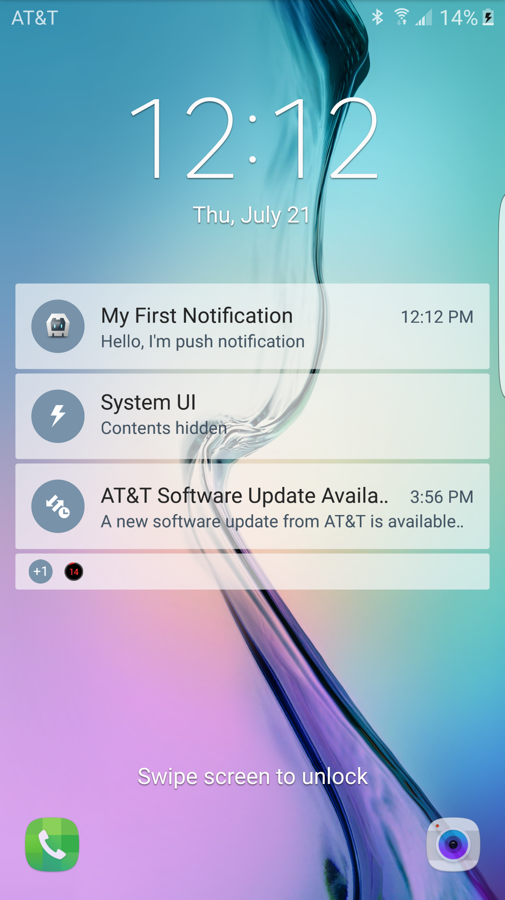
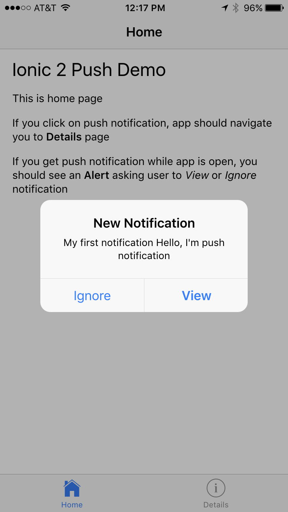

Ionic Push Base
=================

This can be used as base template for Ionic Push apps. It's working for both iOS and Android Push Notifications.
  
## Tutorial
* [Push Notifications in Ionic](https://medium.com/@ankushaggarwal/push-notifications-in-ionic-658461108c59)
* [FCM Setup for Android Notifications](https://medium.com/@ankushaggarwal/gcm-setup-for-android-push-notifications-656cfdd8adbd)
* [APNS Setup for IOS Notifications](https://medium.com/@ankushaggarwal/generate-apns-certificate-for-ios-push-notifications-85e4a917d522)

## Prerequisites
- Download nodejs from https://nodejs.org/en/download/current/ It will install `node` and `npm`
```bash
node -v
 - should be >= 6.0.0
npm -v
 - should be >= 3.0.0
```
- For iOS, update XCode version to 8.0 or higher
- Install cocoapods, required by latest version of phonegap-push-plugin
```bash
sudo gem install cocoapods
pod setup
```

## Getting Started

* Clone this repository

* Install Ionic, cordova and node_modules

    ```bash
    $ npm install -g ionic cordova
    $ npm install
    ```

* Generate **SENDER_ID** using this [tutorial](https://medium.com/@ankushaggarwal/gcm-setup-for-android-push-notifications-656cfdd8adbd) :+1:
  
* _Replace **YOUR_SENDER_ID** in **config.xml and app.ts** with above **SENDER_ID**_

### Android

```bash
    $ ionic cordova platform add android
    $ ionic cordova build android
    $ ionic cordova run android
```

### iOS
```bash
    $ ionic cordova platform add ios
    $ ionic cordova build ios
```    
    Run using XCode


####Use device token printed in console for push notifications using below server code

## Push Notifications Preview in lock screen and while using App

* Android
  
  
  

* iOS

  
  
    
 
Server Code
=================
[Push Notifications Server code](https://github.com/aggarwalankush/push-notification-server) :tada::+1:
It has server code used to send Push Notification to iOS and Android device.


## File Structure of App

```
ionic-push-base/
|-- src/
|    |-- app/
|    |    ├── app.ts
|    |    └── app.module.ts
|    |    └── main.ts
|    |
|    |-- pages/                          * Contains all of our pages
│    │    ├── details/                   * Push Details tab page
│    │    │    ├── detail.html           * DetailsPage template
│    │    │    └── detail.ts             * DetailsPage code
│    │    │
│    │    ├── home/                      * Home page
│    │    │    ├── home.html             * HomePage template
│    │    │    └── home.ts               * HomePage code
│    │    │
│    │    ├── tabs/                      * Tabs page
│    │    │    ├── tabs.html             * TabsPage template
│    │    │    └── tabs.ts               * TabsPage code
│    │    │
│    ├── theme/                          * App theme files
|    |     ├── variables.scss            * App Shared Sass Variables
|    |
|    |-- index.html
|    |-- manifest.json
|    |-- service-worker.js
|
├── .editorconfig                        * Defines coding styles between editors
├── .gitignore                           * Example git ignore file
├── LICENSE                              * MIT License
├── README.md                            * This file
├── config.xml                           * Cordova configuration file
├── ionic.config.json                    * Ionic configuration file
├── package.json                         * Defines our JavaScript dependencies
├── tsconfig.json                        * Defines the root files and the compiler options
├── tslint.json                          * Defines the rules for the TypeScript linter   
```
